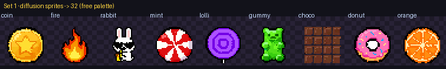
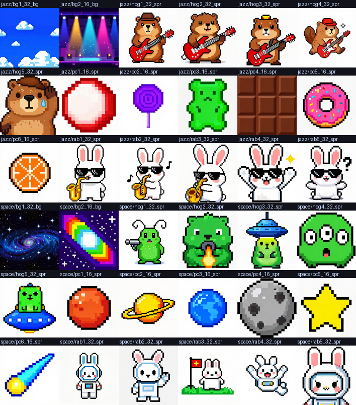
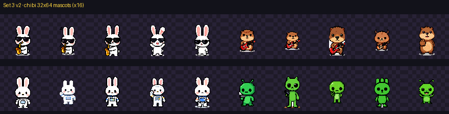
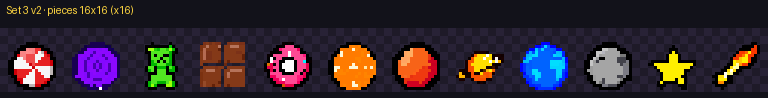

# Experiments — three worked sets (diffusion front-end)

Three generated sets, growing in scope, all through the same back-end (`diffuse_quant.py` + `quant.py`).
Generator: **Z-Image Turbo** (ComfyUI, nvfp4, 10 steps, on a GB10). Judge: **Claude Opus 4.8**. Every
sprite is generated — no third-party assets. The `.html` reports are self-contained (open them locally;
GitHub won't render them inline).

---

## Set 1 · Diffusion vs SVG — the method comparison

Does a diffusion front-end beat the LLM-SVG one? Same subjects, same back-end, same judge.



**Finding:** diffusion wins on quality (esp. at 32×32); it still can't draw a true tiny grid (generate
big → downscale) and the palette lock is a deterministic post-step. Full guide + verdict:
[`DIFFUSION_VS_SVG.md`](DIFFUSION_VS_SVG.md) · report: `reports/diffusion_vs_svg.html` · data: `zimage_raw/`.

## Set 2 · Two themed sets, first pass (×8 vs ×16)

Two complete sets — **Cosmic Jazz** and **Deep Space** — each generated at ×8 and ×16 to compare the
sampling. First pass used *action* poses at 32×32.



**Lesson learned:** action-scene poses (smash-jump, being-beamed-up, firing-a-beam) shrink the character
too much to read at sprite size — which motivated Set 3. Data: `zimage_sets/`.

## Set 3 · Two themed sets, refined — chibi portraits + two piece sizes

The usable version. **32×64 二頭身 (2-head chibi) portrait** mascots that fill the frame (expression +
signature prop only, no scene); pieces at **both 32² and 16²** (16² so a match-3 board can go 6×6+).




Each mascot has 5 poses, each theme 6 pieces × 2 sizes + 2 backgrounds, every asset at ×8 and ×16.
Report: `reports/sets_x8_vs_x16.html` · data: `zimage_sets2/`.

**×8 vs ×16 verdict:** 16×16 pieces are effectively identical → ship pieces at **×8**; 32×64 mascots keep
a little more edge detail at ×16 → use ×16 only for hero frames. 512 (×16) is the quality ceiling, ×8 the
throughput pick (~2.3× faster).

---

## Reproduce

```sh
python3 comfyui/gen_zimage_sprites.py     # (or gen_sets*.py) — ComfyUI @ your GPU host → rasters
python3 diffuse_quant.py <raster> --size 32                    # sprite (square)
python3 diffuse_quant.py <raster> --size 16 --palette palettes/candy.hex   # hard palette lock
python3 build_page.py        # → reports/diffusion_vs_svg.html
python3 build_sets_page.py   # → reports/sets_x8_vs_x16.html
```

`diffuse_quant.py` handles square sprites, **non-square** (32×64 via `process_rect`), and **background
tiles** (`--bg`, keep the full frame). See [`DIFFUSION_VS_SVG.md`](DIFFUSION_VS_SVG.md) for the ComfyUI
workflow setup, prompt templates, and the palette/theme coherence control.
