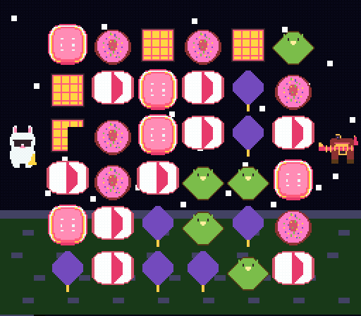

# prompt2sprite

**One prompt → a whole game's worth of recognisable pixel-art sprites.** Not a single icon — a *coherent
set* (pieces, characters, mascots) sharing one hardware-legal palette, ready to drop into a retro-console
game.

It works by having an LLM draw in the representation it is actually *native* at (**SVG code, not raw
pixel grids**), then doing the hardware-bound colour maths in Python (perceptual downscale → BGR555 →
shared palette → CHR). A palette **theme** is what makes the whole set cohere from a single prompt — the
same gamut across every asset, snapped to one legal bank.

The point of this repo is **the methodology and its evidence**, not the code: every step was chosen by
an experiment against alternatives, scored only on recognisability. See **[`METHODOLOGY.md`](METHODOLOGY.md)** —
it is the centre of gravity here.

> **Model-agnostic method, one model's numbers.** The pipeline is not tied to any specific LLM — point
> `SFC_LLM_URL` at any OpenAI-compatible endpoint whose model can emit SVG. But be honest about the
> evidence: two distinct roles, two distinct models —
> - **Sprites (generation):** **[Qwen3.8-27B](https://github.com/pottokao-dotcom/snes-lora-agent-qwen3.8-27b)** (base, no LoRA). Every sprite/measurement here was drawn by it.
> - **Recognisability scores & candidate picks (the judge):** **Claude Opus 4.8** (a vision-capable agent), not a human panel or an automated metric.
>
> The *method* should transfer to other models on both sides; the specific scores are for this
> generator + this judge and may differ with others. Swap either and re-run the `compare_*.py` benches.



*The pieces and mascots above were generated by this pipeline; the game around them is a showcase (see
scope below).*

---

## The findings, in one screen (each is measured, not assumed)

| Decision | Why | Evidence |
|---|---|---|
| **Front-end = SVG** | declarative, fixed `viewBox`, zero execution risk — native to the model | method matrix: svg avg **6.0/10** vs canvas 3.7 vs ascii/json **0.0** (`evidence/style_montage.png`) |
| **Draw at 4×, cap 64 px** | "draw big → compress" keeps the silhouette; ~64 px is the model's fluent zone | drawing a 32 px target at 128 px goes **sparse**; 64 px fixes it. 64/16 = integer 4:1 downscale |
| **modal downscale, not LANCZOS** | a flat SVG's palette is discrete; LANCZOS blends → invents colours → mud + fringe | same coin: LANCZOS **15 colours, muddy** vs modal **3 colours, crisper** (`evidence/quant_montage.png`) |
| **OKLab colour distance** | RGB Euclidean mis-ranks perceptually; OKLab lands colours where the eye wants | perceptual clustering, zero-cost maths upgrade |
| **BGR555 snap + alpha transparency** | SNES CGRAM is 15-bit; alpha (not a magenta key) avoids pink fringe | preview == ROM |
| **Palette control = a THEME** | a mood word is loose to the LLM but a real gamut bound; makes the shared-palette extraction near-lossless | shared-master delta **0.008** (< 0.02 JND); colour spread free 0.272 → themed **0.089** (`evidence/theme_montage.png`, `constraint_montage.png`) |

Full reasoning, the falsifying result for each, and the honest limits: **[`METHODOLOGY.md`](METHODOLOGY.md)**.

## Quickstart

```sh
# needs an OpenAI-compatible LLM that can emit SVG (default http://localhost:8001, model "qwen38")
export SFC_LLM_URL=http://localhost:8001
pip install pillow cairosvg numpy

python3 make_sprite.py "a shiny gold coin"          --size 16                 # icon
python3 make_sprite.py "a fireball"                 --size 16 --style shade   # organic FX
python3 make_sprite.py "a jazz rabbit with a sax"   --size 32                 # character
python3 make_sprite.py "a candy" --size 16 --theme candy    # whole-game palette coherence
python3 make_sprite.py --list-themes                                          # 32 palette presets (+ custom)
```

Output: `out/<slug>_<size>.png` (target sprite) + `out/<slug>_<size>_raw.png` (RAW, for sheets/CHR).
Best-of-N with a non-degenerate probe → never ships a blank. Downstream: feed the sheet to `gfx4snes`
(see `example_cosmicjazz/`) for the CHR bitplane.

## What's inside

```
METHODOLOGY.md              ← the point: why each decision, the experiment, the numbers, the falsifier
make_sprite.py              the tool (SVG draw → quantise → BGR555)
quant.py                    pluggable quantiser registry (downsampler × reducer), OKLab, shared palette
judge.py                    optional vision-judge gate (recognisability best-of-N)
compare_{style,quant,theme,constraint}.py   the benches that (re)generate the evidence montages
PIXEL_CAPABILITY_REPORT.md  the benchmark scores
PIXEL_TOOLS_DESIGN.md       frozen architecture + reasoning
evidence/                   every montage + on-hardware screenshots + the gameplay GIF/MP4
example_cosmicjazz/         a runnable SNES match-3 the sprites went into (build + play)
END_TO_END.md               text → sprite → CHR → running ROM, with the hardware gotchas
TUTORIAL_sound_effects.md   standalone how-to (SPC700 SFX + the queued-load gotcha)
```

## Demonstration — sprites on real hardware

`example_cosmicjazz/` is a complete, buildable SNES match-3 whose pieces and mascots were made by this
pipeline (one shared 16-colour OBJ palette), shown running under Mesen2:

| | |
|---|---|
| generated pieces on a 6×6 board + mascots | `evidence/onROM_board_plus_mascots.png` |
| old (LANCZOS) vs new (modal) quantise | `evidence/old_vs_new.png` |
| palette-theme coherence + shared master | `evidence/theme_montage.png` |
| full gameplay (idle → match feedback) | `evidence/cosmicjazz_gameplay.gif` |

## Scope — what's validated vs. what's a showcase

The **validated** contribution is the **art pipeline and its methodology** (measured above, shown on
hardware). The game in `example_cosmicjazz/` is a **showcase**: only its *sprites* came from this
pipeline — the game logic, animation, screen-shake/flash juice and sound effect **C was hand-written**,
not model-generated. It's there to prove the sprites reach a real ROM (with the hardware gotchas noted in
`END_TO_END.md`), not to claim the pipeline authored a game.

Honest limits (from `METHODOLOGY.md`): single-shot is high-variance (use best-of-N + a judge); the model
draws structured objects/characters well but **abstract symbols poorly** (heart/star → generic gems);
resolution is a hard floor (fine detail dies at 16 px); scores are single-axis, single-judge, *relative*
evidence between methods on one model.

## Related

This started inside a larger project — a **[SNES game-generation agent + a Qwen3.8-27B LoRA](https://github.com/pottokao-dotcom/snes-lora-agent-qwen3.8-27b)**
(LLM writes game logic, LoRA supplies console idioms, Python tools build & probe). This pipeline is the
independently-measured art piece of it, extracted to stand on its own.

## License

MIT — see [LICENSE](LICENSE). Uses PVSnesLib (zlib) and `gfx4snes` in the example. Sprites are generated;
no Nintendo assets are included.
